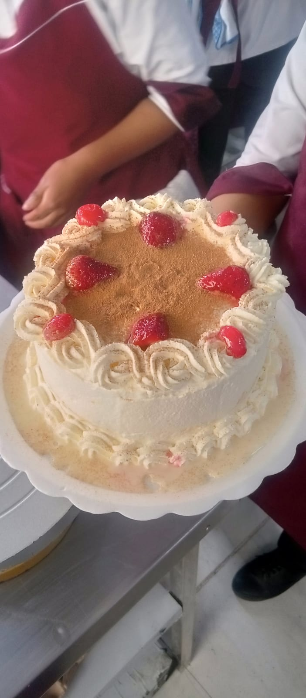

# Sesion 02
## .gitignore y markdown

**Hola, mi nombre es Anahi** y estoy feliz

> showme the code

Mis archivos
1. .gitignore
2. clavez.txt
3. README.md
4. torta.jpg

# 1. titulo 1
## 1.1. titulo 2
### 1.1.1. titulo 3

hola**bold text**

hola *italic text*
para leer ctrl+shift+v

citas
> contenido de otra fuente
Listas ordenadas
1. First item
2. Second item
3. Third item
Listas no ordenadas
- First item
- second item
- third item
Listas no ordenadas
* First
* second
* third
  Codigo
  
[titulo]{http://miruta.com}

